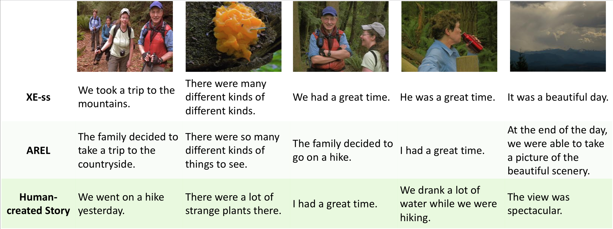

# No Metrics Are Perfect: Adversarial REward Learning for Visual Storytelling

This repo is the implementation of our paper "No Metrics Are Perfect: Adversarial Reward Learning for Visual Storytelling", which also provides a codebase for the task of visual storytelling.

In the AREL paper, we not only introduce a novel adversarial reward learning algorithm to generate more human-like stories given image sequences, but also empirically analyze the limitations of the automatic metrics for story evaluation. 
For more details, please check the latest version of the paper: [https://arxiv.org/abs/1804.09160](https://arxiv.org/abs/1804.09160).

<p align="demo">

</p>

## Prerequisites 
- Python 2.7
- PyTorch 0.3
- TensorFlow (optional, only using the fantastic tensorboard)
- cuda & cudnn

## Usage
### 1. Setup
Clone this github repository recursively: 

```
git clone --recursive https://github.com/eric-xw/AREL.git ./
```

Download the preprocessed ResNet-152 features [here](https://vist-arel.s3.amazonaws.com/resnet_features.zip) and unzip it into `DATADIR/resnet_features`.

### 2. Supervised Learning
We use cross entropy loss to warm start the model first:

```
python train.py --id XE --data_dir DATADIR --start_rl -1
```

Check the file `opt.py` for more options, where you can play with some other settings.

### 3. AREL Learning
To train an AREL model, run

```
python train_AREL.py --id AREL --start_from_model PRETRAINED_MODEL
```

Note that `PRETRAINED_MODEL` can be `data/save/XE/model.pth` or some other saved models. 
Check `opt.py` for more information.

### 4. Monitor your training
TensorBoard is used to monitor the training process. Suppose you set the option `checkpoint_path` as `data/save`, then run

```
tensorboard --logdir data/save/tensorboard
```

And then open your browser and go to `[IP address]:6006` (the default port for tensorboard is `6006`).

### 5. Testing
To test the model's performance, run

```
python train.py --option test --beam_size 3 --start_from_model data/save/XE/model.pth
```

or 

```
python train_AREL.py --option test --beam_size 3 --start_from_model data/save/AREL/model.pth
```

### Reproducing our results
We uploaded our checkpoints and meta files to the [IRL-ini-iter100-*](https://github.com/eric-xw/AREL/tree/master/data/save). Please load the model from these folders by running

```
python train.py --option test --beam_size 3 --start_from_model [best_model_path]
```

## If you find this code useful, please cite the paper
```
@InProceedings{xwang-2018-AREL,
  author = 	"Wang, Xin and Chen, Wenhu and Wang, Yuan-Fang and Wang, William Yang",
  title = 	"No Metrics Are Perfect: Adversarial Reward Learning for Visual Storytelling",
  booktitle = 	"Proceedings of the 56th Annual Meeting of the Association for Computational Linguistics (Volume 1: Long Papers)",
  year = 	"2018",
  publisher = 	"Association for Computational Linguistics",
  pages = 	"899--909",
  location = 	"Melbourne, Australia",
  url = 	"http://aclweb.org/anthology/P18-1083"
}
```

## Acknowledgement
* [VIST evaluation code](https://github.com/lichengunc/vist_eval)
